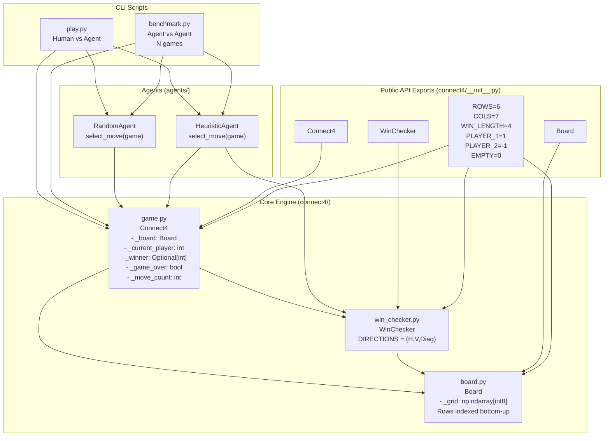

# Architecture Overview

This diagram shows how the engine, agents, and CLI scripts fit together.

```mermaid
flowchart TD
    subgraph PublicAPI["Public API Exports (connect4/__init__.py)"]
        Connect4Class["Connect4"]
        BoardClass["Board"]
        WinCheckerClass["WinChecker"]
        Constants["ROWS=6\nCOLS=7\nWIN_LENGTH=4\nPLAYER_1=1\nPLAYER_2=-1\nEMPTY=0"]
    end

    subgraph Core["Core Engine (connect4/)"]
        Connect4["game.py\nConnect4\n- _board: Board\n- _current_player: int\n- _winner: Optional[int]\n- _game_over: bool\n- _move_count: int"]
        Board["board.py\nBoard\n- _grid: np.ndarray[int8]\nRows indexed bottom-up"]
        WinChecker["win_checker.py\nWinChecker\nDIRECTIONS = (H,V,Diag)"]
    end

    subgraph Agents["Agents (agents/)"]
        RandomAgent["RandomAgent\nselect_move(game)"]
        HeuristicAgent["HeuristicAgent\nselect_move(game)"]
    end

    subgraph CLI["CLI Scripts"]
        Play["play.py\nHuman vs Agent"]
        Benchmark["benchmark.py\nAgent vs Agent\nN games"]
    end

    Play --> Connect4
    Play --> RandomAgent
    Play --> HeuristicAgent

    Benchmark --> Connect4
    Benchmark --> RandomAgent
    Benchmark --> HeuristicAgent

    Connect4 --> Board
    Connect4 --> WinChecker
    WinChecker --> Board

    RandomAgent --> Connect4
    HeuristicAgent --> Connect4
    HeuristicAgent --> WinChecker

    Connect4Class --> Connect4
    BoardClass --> Board
    WinCheckerClass --> WinChecker
    Constants --> Connect4
    Constants --> Board
    Constants --> WinChecker
```
