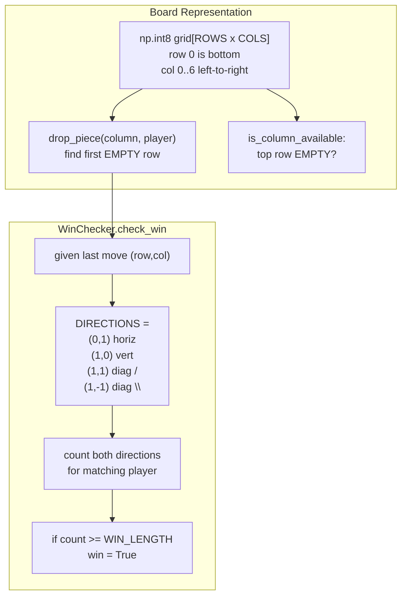

# Board and Win Logic

This diagram shows the grid representation and the win-checking logic.

```mermaid
flowchart TD
    subgraph BoardRepresentation["Board Representation"]
        Grid["np.int8 grid[ROWS x COLS]\nrow 0 is bottom\ncol 0..6 left-to-right"]
        DropLogic["drop_piece(column, player)\nfind first EMPTY row"]
        Availability["is_column_available:\ntop row EMPTY?"]
    end

    subgraph WinLogic["WinChecker.check_win"]
        StartWin["given last move (row,col)"]
        Directions["DIRECTIONS =\n(0,1) horiz\n(1,0) vert\n(1,1) diag /\n(1,-1) diag \\"]
        Count["count both directions\nfor matching player"]
        Compare["if count >= WIN_LENGTH\nwin = True"]
    end

    Grid --> DropLogic --> StartWin --> Directions --> Count --> Compare
    Grid --> Availability
```
