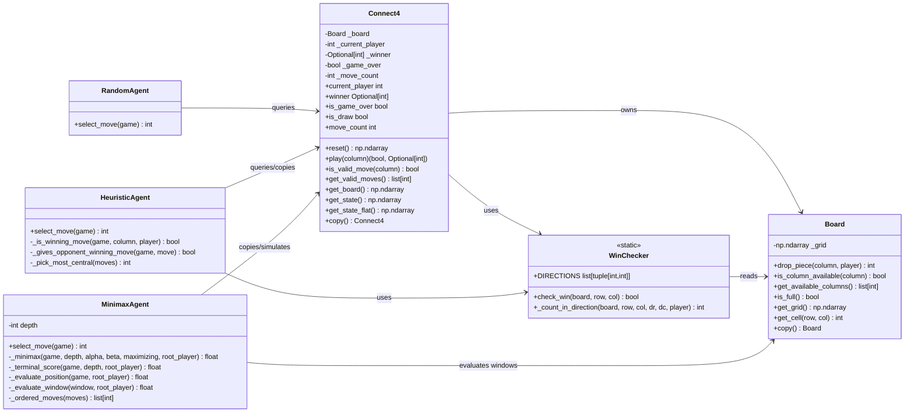

# Class Diagram

This diagram captures the core classes and relationships in the current codebase.

```mermaid
classDiagram
    direction LR

    class Connect4 {
        -Board _board
        -int _current_player
        -Optional[int] _winner
        -bool _game_over
        -int _move_count
        +reset() np.ndarray
        +play(column) (bool, Optional[int])
        +is_valid_move(column) bool
        +get_valid_moves() list[int]
        +get_board() np.ndarray
        +get_state() np.ndarray
        +get_state_flat() np.ndarray
        +copy() Connect4
        +current_player int
        +winner Optional[int]
        +is_game_over bool
        +is_draw bool
        +move_count int
    }

    class Board {
        -np.ndarray _grid
        +drop_piece(column, player) int
        +is_column_available(column) bool
        +get_available_columns() list[int]
        +is_full() bool
        +get_grid() np.ndarray
        +get_cell(row, col) int
        +copy() Board
    }

    class WinChecker {
        <<static>>
        +DIRECTIONS list[tuple[int,int]]
        +check_win(board, row, col) bool
        +_count_in_direction(board, row, col, dr, dc, player) int
    }

    class RandomAgent {
        +select_move(game) int
    }

    class HeuristicAgent {
        +select_move(game) int
        -_is_winning_move(game, column, player) bool
        -_gives_opponent_winning_move(game, move) bool
        -_pick_most_central(moves) int
    }

    class MinimaxAgent {
        -int depth
        +select_move(game) int
        -_minimax(game, depth, alpha, beta, maximizing, root_player) float
        -_terminal_score(game, depth, root_player) float
        -_evaluate_position(game, root_player) float
        -_evaluate_window(window, root_player) float
        -_ordered_moves(moves) list[int]
    }

    Connect4 --> Board : owns
    Connect4 --> WinChecker : uses
    WinChecker --> Board : reads
    RandomAgent --> Connect4 : queries
    HeuristicAgent --> Connect4 : queries/copies
    HeuristicAgent --> WinChecker : uses
    MinimaxAgent --> Connect4 : copies/simulates
    MinimaxAgent --> Board : evaluates windows
```
