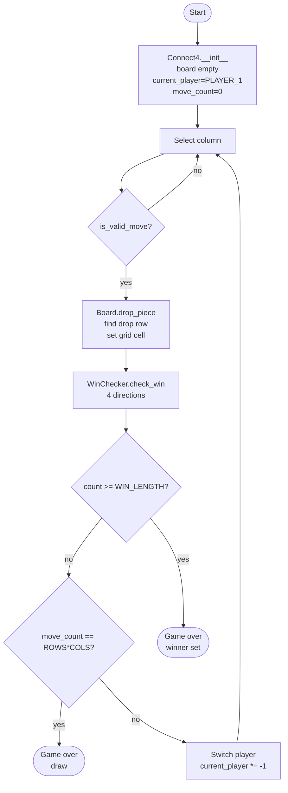

# Game Loop Flow

This flowchart focuses on `Connect4.play()` and how wins/draws are determined.

```mermaid
flowchart TD
    Start([Start])
    Init[Connect4.__init__\nboard empty\ncurrent_player=PLAYER_1\nmove_count=0]
    Input[Select column]
    Valid{is_valid_move?}
    Drop[Board.drop_piece\nfind drop row\nset grid cell]
    WinCheck[WinChecker.check_win\n4 directions]
    Win{count >= WIN_LENGTH?}
    Draw{move_count == ROWS*COLS?}
    Switch[Switch player\ncurrent_player *= -1]
    EndWin([Game over\nwinner set])
    EndDraw([Game over\ndraw])

    Start --> Init --> Input --> Valid
    Valid -- no --> Input
    Valid -- yes --> Drop --> WinCheck --> Win
    Win -- yes --> EndWin
    Win -- no --> Draw
    Draw -- yes --> EndDraw
    Draw -- no --> Switch --> Input
```
