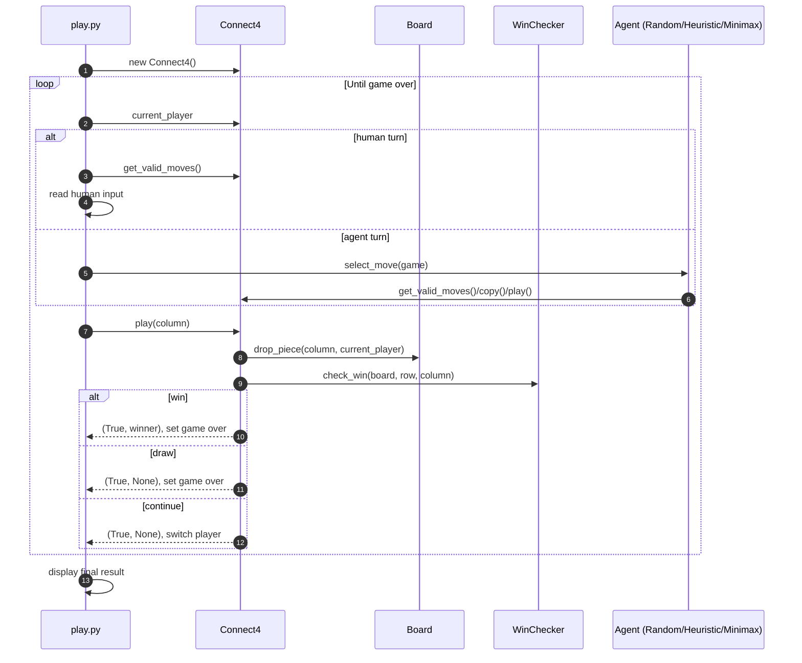

# Gameplay Sequence

This sequence diagram shows the `play.py` loop for a human vs agent game.

```mermaid
sequenceDiagram
    autonumber
    participant UI as play.py
    participant Game as Connect4
    participant Board as Board
    participant Win as WinChecker
    participant Agent as Agent (Random/Heuristic/Minimax)

    UI->>Game: new Connect4()
    loop Until game over
        UI->>Game: current_player
        alt human turn
            UI->>Game: get_valid_moves()
            UI->>UI: read human input
        else agent turn
            UI->>Agent: select_move(game)
            Agent->>Game: get_valid_moves()/copy()/play()
        end
        UI->>Game: play(column)
        Game->>Board: drop_piece(column, current_player)
        Game->>Win: check_win(board, row, column)
        alt win
            Game-->>UI: (True, winner), set game over
        else draw
            Game-->>UI: (True, None), set game over
        else continue
            Game-->>UI: (True, None), switch player
        end
    end
    UI->>UI: display final result
```
